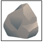
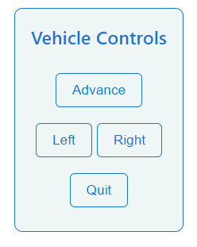
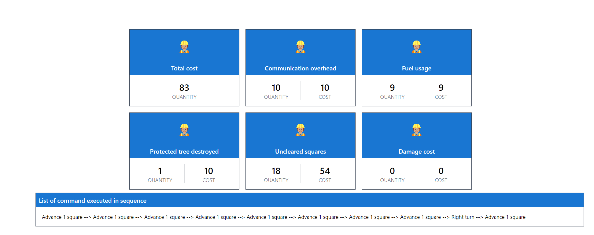

# Construction Site Clearing Simulator

### Demo on how to use site clearing simulator

# Application Requirements

### Rules

The site map is defined by a text file with one character per square of the site. Each row must have the same number of
characters. Plain land is marked with the letter ‘o’, rocky land is marked with the letter ‘r’, removable trees are
marked with the letter ‘t’, and trees that must be preserved are marked with the letter ‘T’. For example, the following
describes a site that is 10 squares wide and 5 squares deep: ootooooooo oooooooToo rrrooooToo rrrroooooo rrrrrtoooo

### Inputs

- A file containing a site map. This will be processed when the application is started
  and / or via an Upload Site Map button. Uploading a site map should clear any
  existing simulation data and prepare the application for a new simulation session.
- Commands entered by the trainee using controls as described below under "Sequence
  of Operation".

### Outputs (updated as commands are entered)

- A list of all the commands that have been entered by the trainee.
- A table providing itemized costs of the clearing operation and a total cost.

### User Interface

- The UI should be clear and allow the trainee to proceed from simulation start to end.
- A site map should be shown along with an indication of which square the bulldozer is
  currently located in and its current orientation.
- Control buttons are required for directing bulldozer movement and ending the
  simulation (quit).
- Command list and reports should be updated in real-time and final lists and reports
  shown at simulation end.

# Instruction on how to execute solution locally

- You can clone or download repo locally.
- Run `npm install` under root folder. (You should have [Angular CLI](https://github.com/angular/angular-cli)
  and [Node js](https://nodejs.org/en/download/) pre-installed)
- Once all the dependencies are installed under `node_modules`, Run `ng serve` for a dev server. Navigate
  to `http://localhost:4200/`. You should be able to test application locally now.

# Application architecture

- Application is utilizing the latest Angular as front-end framework with Lazy loading for performance
  optimization as best practice. (Technology used: Angular/Typescript/NxRedux/Ngx-toastr/Karma/Jasmine/SCSS)
- There are two main modules which splits the application:
  1. [UploadFileModule](src/app/upload-file/upload-file.module.ts)

     - Upload site map module [UploadFileModule](src/app/upload-file/upload-file.module.ts) with default route `/`.
     - This module takes care of selected file validation and showing error if any using ngx-toastr notification service.

  2. [SiteSimulatorModule](src/app/site-simulator/site-simulator.module.ts)

     - Site simulator module displays simulated construction site map on screen which is rectangular shape, described as
       a grid of square blocks each with equal size.
     - This module is responsible for below operations:
       1. Replacing input characters ('o', 'r', 't', 'T') with respective svg representation.
       2. Control buttons UI and functionalities.
       3. On each button operation moving bulldozer one cell, changing bulldozer direction and quiting simulation if user
          requires.
       4. Storing data as part of NgRedux state to track application state.
       5. At the end of simulation calculating fuel usage consumption, history of commands executed, if protected trees are
          destroyed, any uncleared squared left and showing itemized report on UI screen.

# Sequence of Operation

- The application is started by visiting a `http://localhost:4200/`. The UI will indicate that a site map is
  required to begin the simulation. (Sample test data files can be found under **[test-data directory](test-data)**)
- Once a site map has been processed and validation is successful, it is displayed on-screen for the trainee.
- Control buttons ([for details on each button command see section Control buttons](#Control buttons)) direct the
  movement of the bulldozer. Commands are executed as
  soon as the user pushes a control button until one of the following events occurs:
  - there is an attempt to navigate beyond the boundaries of the site;
  - there is an attempt to remove a tree that is protected;
  - a new simulation session is started;
  - the trainee presses the quit button.
- The itemised expense report is updated as each command is processed.
- As each command is entered, it is added to a list of processed commands.
- The simulation ends and new bulldozer commands are no longer accepted. The final
  list of commands and itemised expense report is displayed on the screen.

# Example site map data

| Valid site map | Invalid data with length mismatch | Invalid data with first letter as protected tree |
|:--------------:|:---------------------------------:|:------------------------------------------------:|
|   ootooooooo   |            ootooooooo             |                    Totooooooo                    |
|   oooooooToo   |              ooooooo              |                     ooooooo                      |
|   rrroootToo   |               rrro                |                       rrro                       |
|   rrrroooooo   |            rrrroooooo             |                    rrrroooooo                    |
|   rrrrrtoooo   |            rrrrrtoooo             |                    rrrrrtoooo                    |

# Site map input data and visual representation

-  => Plain land (0) is be represented with (./plain-land.svg)
-  => Rocky land (r) is be represented with (./rocky-land.svg)
-  => Removable tree (t) is be represented with (./removable-trees.svg)
-  => Protected tree (T) is be represented with (./protected-tree.svg)
-  => Vehicle is be represented with (./bulldozer.svg)

# Control buttons

- **Advance**: This causes the bulldozer to move forwards one square (in whatever direction it is currently facing)
- **Left**: Turn the bulldozer (on the spot) 90 degrees to the left of the direction it is facing
- **Right**: turn the bulldozer 90 degrees to the right
- **Quit**: end the simulation
- 

# Final report UI look

# Out of scope but nice to have things

- App can be responsive to support all devices.
- UI design could be more fine-tuned with some more time.

# Angular CLI project

This project was generated with [Angular CLI](https://github.com/angular/angular-cli) version 13.3.5.

## Development server

Run `ng serve` for a dev server. Navigate to `http://localhost:4200/`. The application will automatically reload if you
change any of the source files.

## Code scaffolding

Run `ng generate component component-name` to generate a new component. You can also
use `ng generate directive|pipe|service|class|guard|interface|enum|module`.

## Build

Run `ng build` to build the project. The build artifacts will be stored in the `dist/` directory.

## Running unit tests

Run `ng test` to execute the unit tests via [Karma](https://karma-runner.github.io).

## Running end-to-end tests

Run `ng e2e` to execute the end-to-end tests via a platform of your choice. To use this command, you need to first add a
package that implements end-to-end testing capabilities.

## Further help

To get more help on the Angular CLI use `ng help` or go check out
the [Angular CLI Overview and Command Reference](https://angular.io/cli) page.
